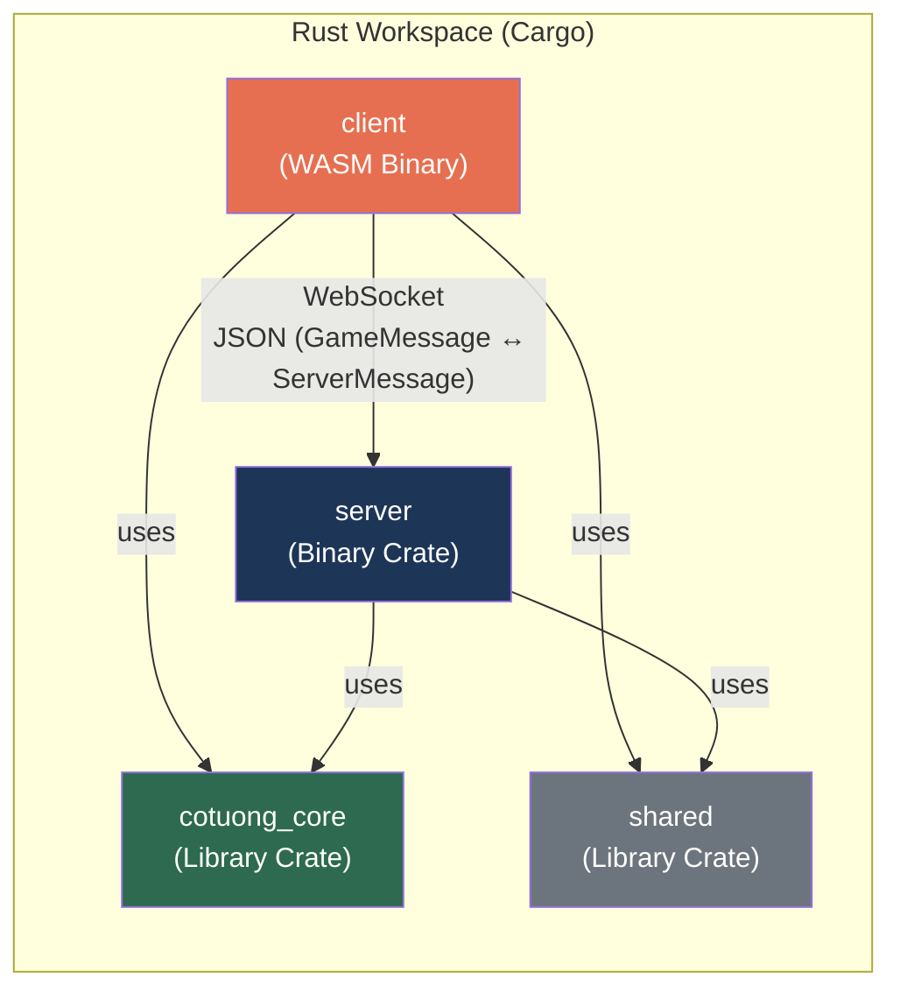
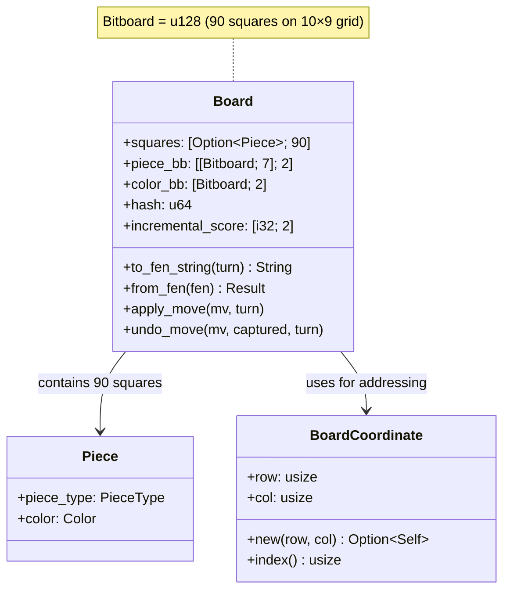
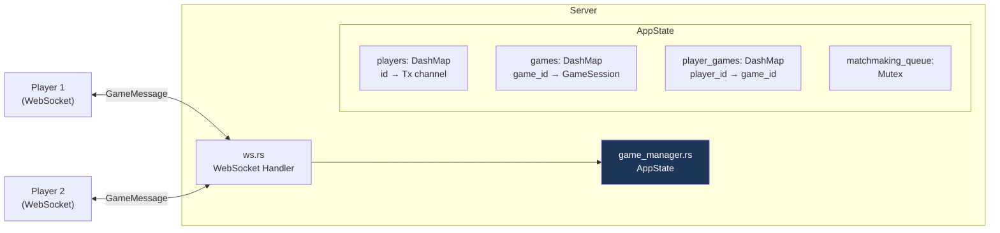
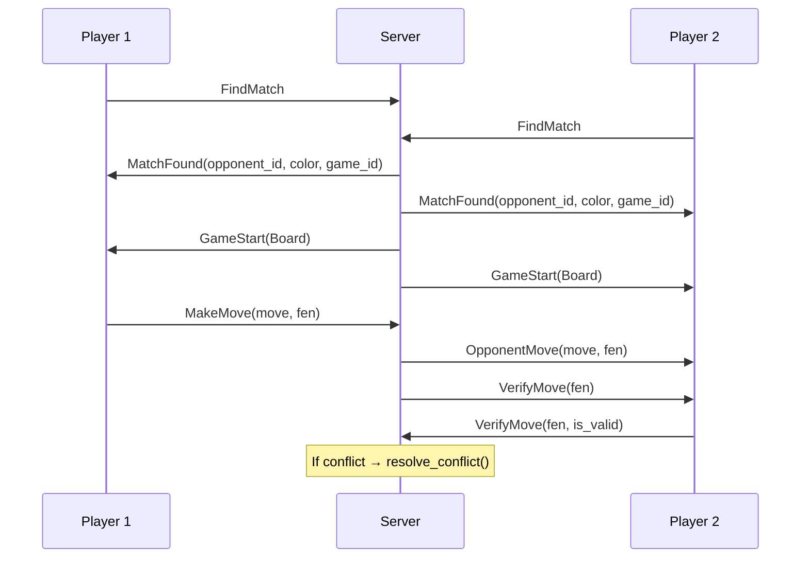
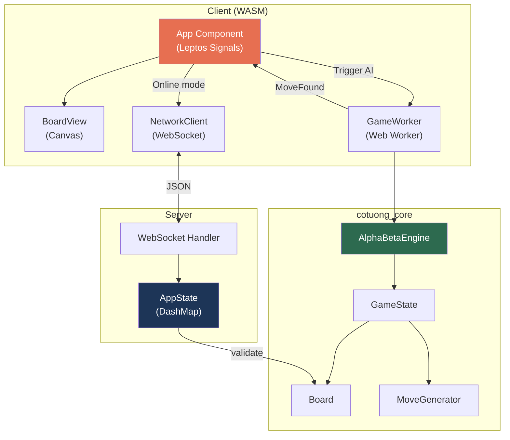

# GameCoTuong – Architecture Overview

> Cờ Tướng (Xiangqi / Chinese Chess) engine & full-stack multiplayer application viết bằng Rust.



---

## 1. Workspace Structure

```
GameCoTuong/
├── Cargo.toml          # Workspace root – clippy pedantic/nursery, LTO fat release
├── cotuong_core/       # AI Engine + Game Logic (library)
├── server/             # Multiplayer WebSocket Server (binary)
├── client/             # WASM Frontend – Leptos (binary)
├── shared/             # Protocol messages (library)
└── test_all.sh         # Integration test runner
```

Workspace-level lints **deny** tất cả `warnings`, `clippy::all`, `clippy::pedantic`, `clippy::nursery`, `clippy::unwrap_used`, `clippy::expect_used`, `clippy::indexing_slicing`.

---

## 2. `cotuong_core` – AI Engine & Game Logic

Crate trung tâm, cung cấp toàn bộ luật chơi và AI engine. Được compile cả native (server) và WASM (client).

### 2.1. Module Map

```
cotuong_core/src/
├── lib.rs              # Re-exports: engine, logic, worker
├── worker.rs           # gloo-worker Web Worker bridge (WASM)
├── engine/
│   ├── mod.rs          # Traits: Evaluator, Searcher; Structs: Move, SearchLimit, SearchStats
│   ├── config.rs       # EngineConfig – JSON-configurable parameters
│   ├── search.rs       # AlphaBetaEngine – Negamax search (1316 lines)
│   ├── eval.rs         # SimpleEvaluator – Board evaluation (423 lines)
│   ├── tt.rs           # TranspositionTable – Hash-indexed cache
│   ├── zobrist.rs      # ZobristKeys – Position hashing (XorShift64 RNG)
│   ├── move_list.rs    # MoveList – Stack-allocated [Move; 128]
│   ├── bench_test.rs   # Performance benchmarks
│   ├── mate_test.rs    # Checkmate detection tests
│   └── search_test_snippet.rs
└── logic/
    ├── mod.rs
    ├── board.rs         # Board, Piece, Color, PieceType, BoardCoordinate, Bitboard (u128)
    ├── game.rs          # GameState – Turn management, move history, undo, repetition
    ├── generator.rs     # MoveGenerator – Legal move generation (lookup table-based)
    ├── rules.rs         # Move validation, check detection, flying general
    ├── lookup.rs        # AttackTables – Precomputed rook/cannon/horse/elephant/... moves
    ├── eval_constants.rs # Piece values, PST tables, mobility weights
    ├── opening.rs       # Opening book (hardcoded FEN-based)
    └── repetition_test.rs
```

### 2.2. Board Representation



| Feature | Implementation |
|---|---|
| Grid | 10 rows × 9 cols = 90 squares |
| Square Storage | `[Option<Piece>; 90]` cho truy cập nhanh |
| Bitboard | `u128` – 1 bit/ô, dùng cho piece tracking & attack detection |
| Hash | Zobrist hashing (`u64`) – incremental update khi move/undo |
| Score | Incremental score `[i32; 2]` (Red/Black) – cập nhật khi move |
| FEN | Hỗ trợ import/export chuẩn Xiangqi FEN |

### 2.3. AI Engine – `AlphaBetaEngine`


| Technique | Details |
|---|---|
| Search | Negamax Alpha-Beta với Iterative Deepening |
| Move Ordering | TT move → Captures (MVV-LVA) → Killer moves → History heuristic |
| Null-Move Pruning | Reduction R=3, skip khi in-check |
| ProbCut | Statistical forward pruning dựa trên shallow search |
| LMR | Late Move Reduction – bảng precomputed `[[u8; 64]; 64]` |
| Singular Extension | Extend nước đi duy nhất tốt đáng kể |
| Quiescence | Search captures-only để tránh horizon effect |
| Transposition Table | Hash table power-of-2 size, replace-if-deeper scheme |
| Zobrist Hashing | `XorShift64` RNG, `OnceLock` singleton, incremental update |
| Time Control | `Depth(u8)` hoặc `Time(u64)` ms, check mỗi 4096 nodes |
| Repetition Detection | History hash tracking |
| Opening Book | FEN-based lookup (hardcoded starting positions) |

### 2.4. Evaluation – `SimpleEvaluator`

| Component | Description |
|---|---|
| Material | Tổng giá trị quân: Tướng=6000, Xe=600, Pháo=285, Mã=270, Tượng/Sĩ=120, Tốt=30 |
| PST | Piece-Square Tables cho 7 loại quân – flip cho Đen |
| Mobility | Đếm nước đi hợp lệ cho Xe, Mã, Pháo, Tốt (capped) |
| King Safety | Penalty cho Tướng bị lộ, Pháo đối mặt Tướng có giá đỡ |
| Structure | Bonus cho Tượng/Sĩ liên kết |
| Incremental | Score cơ bản (material + PST) được cập nhật incremental trong Board |

### 2.5. Move Generation

- **`MoveGenerator`**: Sinh tất cả nước đi hợp lệ cho 1 bên, sử dụng `AttackTables` lookup.
- **`AttackTables`**: Precomputed tại startup (`OnceLock`):
  - Rook/Cannon: Occupancy-indexed attack tables `[[u16; 1024]; 10]`
  - Horse: `[(target, leg_blocker); 90]`
  - Elephant: `[(target, eye_blocker); 90]`
  - Advisor/General/Soldier: `[targets; 90]`
- **`MoveList`**: Stack-allocated `[Move; 128]`, zero-alloc trong hot path.
- **`has_legal_moves()`**: Early-return kiểm tra nhanh có nước đi hợp lệ (dùng cho mate detection).

### 2.6. Web Worker (`worker.rs`)

`GameWorker` implement `gloo_worker::Worker` – chạy AI search trên background thread (WASM):
- **Input**: `ComputeMove(GameState, SearchLimit, EngineConfig, Vec<Move>)`
- **Output**: `MoveFound(Move, SearchStats)`

---

## 3. `server` – Multiplayer WebSocket Server

### 3.1. Stack

| Layer | Technology |
|---|---|
| HTTP/WS | Axum 0.7 + WebSocket upgrade |
| Async Runtime | Tokio (full features) |
| Concurrency | `DashMap` (lock-free) + `tokio::sync::RwLock` / `Mutex` |
| Serialization | serde_json |

### 3.2. Architecture



| Component | Responsibility |
|---|---|
| `ws.rs` | WebSocket upgrade, message routing (deserialize `GameMessage` → dispatch) |
| `AppState` | Stateful game manager – DashMap-based concurrent access |
| `GameSession` | Per-game state: Board, turn, players, pending moves, move history |
| Matchmaking | Queue-based: `FindMatch` → pair 2 players → `start_game()` |
| Move Validation | Distributed validation: sender validates → opponent cross-validates → resolve conflicts |
| Game End | Checkmate detection, surrender, disconnect, draw |

### 3.3. Message Flow



---

## 4. `client` – WASM Frontend

### 4.1. Stack

| Layer | Technology |
|---|---|
| Framework | Leptos 0.6 (CSR mode) |
| Compile Target | `wasm32-unknown-unknown` via Trunk |
| AI Worker | `gloo-worker` Web Worker (non-blocking UI) |
| Network | `web_sys::WebSocket` |
| Rendering | HTML Canvas (`CanvasRenderingContext2d`) |

### 4.2. Module Map

```
client/src/
├── main.rs             # Entry point: mount App component
├── app.rs              # Main App component (1529 lines)
│                       # Game modes: HvC, CvC, HvH, Online
│                       # Sub-components: ControlsArea, LogPanel,
│                       # ThinkingIndicator, OnlineStatusPanel,
│                       # ConfigPanel, Slider, Dropdown, etc.
├── network.rs          # NetworkClient (WebSocket wrapper)
├── components/
│   ├── mod.rs
│   └── board.rs        # BoardView – Canvas rendering (19KB)
└── bin/
    └── worker.rs       # Web Worker entry point
```

### 4.3. Game Modes

| Mode | Description |
|---|---|
| `HumanVsComputer` | Người chơi vs AI (Web Worker) |
| `ComputerVsComputer` | AI vs AI (tự động) |
| `HumanVsHuman` | 2 người chơi local (hotseat) |
| `Online` | Multiplayer qua WebSocket |

### 4.4. Rendering Pipeline

Board được render trên HTML Canvas:
1. Vẽ grid 10×9 với các đường kẻ, sông, cung
2. Vẽ quân cờ tại vị trí (circle + text)
3. Highlight: ô được chọn, nước đi hợp lệ, nước đi cuối cùng
4. Interactive: click-to-select, click-to-move

---

## 5. `shared` – Protocol Layer

Chứa 2 enum được serialize/deserialize qua JSON:

### `GameMessage` (Client → Server)
| Variant | Purpose |
|---|---|
| `FindMatch` | Yêu cầu tìm trận |
| `CancelFindMatch` | Hủy tìm trận |
| `MakeMove { move_data, fen }` | Gửi nước đi |
| `VerifyMove { fen, is_valid }` | Xác nhận nước đi đối thủ |
| `Surrender` | Đầu hàng |
| `RequestDraw` / `AcceptDraw` | Đề nghị / chấp nhận hòa |
| `PlayAgain` | Chơi lại |
| `PlayerLeft` | Rời trận |

### `ServerMessage` (Server → Client)
| Variant | Purpose |
|---|---|
| `MatchFound { opponent_id, your_color, game_id }` | Đã ghép trận |
| `GameStart(Board)` | Bắt đầu game |
| `OpponentMove { move_data, fen }` | Đối thủ đi |
| `GameStateCorrection { fen, turn }` | Sửa state khi conflict |
| `GameEnd { winner, reason }` | Kết thúc game |
| `Error(String)` | Lỗi |
| `WaitingForMatch` | Đang chờ đối thủ |
| `OpponentDisconnected` | Đối thủ mất kết nối |

---

## 6. Data Flow Overview



---

## 7. Build & Run

| Target | Command | Notes |
|---|---|---|
| Server | `cargo run -p server` | Listens on `127.0.0.1:3000` |
| Client | `trunk serve` (trong `client/`) | Cần `trunk` + `wasm32-unknown-unknown` target |
| Tests | `./test_all.sh` hoặc `cargo test --workspace` | Bao gồm unit + integration tests |
| Release | Profile: `lto = "fat"`, `codegen-units = 1`, `panic = "abort"` | Tối ưu size & performance |

---

## 8. Key Design Decisions

1. **Rust Full-Stack**: Cùng ngôn ngữ cho engine, server, client → chia sẻ types, zero runtime overhead.
2. **WASM + Web Worker**: AI chạy trên worker thread → UI không bị block khi engine search.
3. **DashMap Concurrency**: Server dùng lock-free `DashMap` thay vì global `Mutex` → không bottleneck.
4. **Bitboard u128**: 90 ô (10×9) fit trong `u128` → bitwise operations nhanh.
5. **Stack-allocated MoveList**: `[Move; 128]` trên stack → zero heap allocation trong search loop.
6. **Incremental Evaluation**: Board cập nhật hash + score khi move/undo → tránh recompute.
7. **Precomputed Lookup Tables**: `AttackTables` + `ZobristKeys` dùng `OnceLock` singleton → tính 1 lần dùng mãi.
8. **Distributed Move Validation**: Server yêu cầu cả 2 player validate → tăng bảo mật, giảm tải server.
